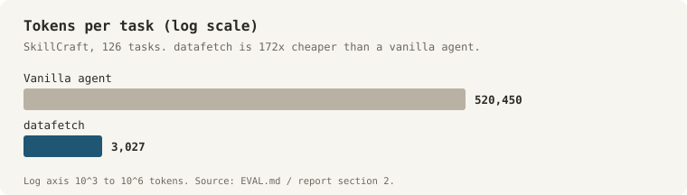
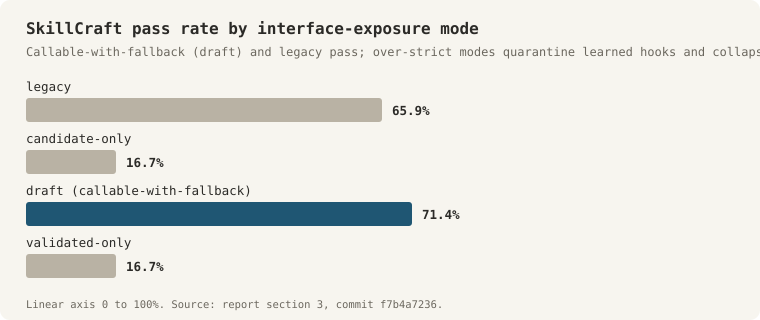
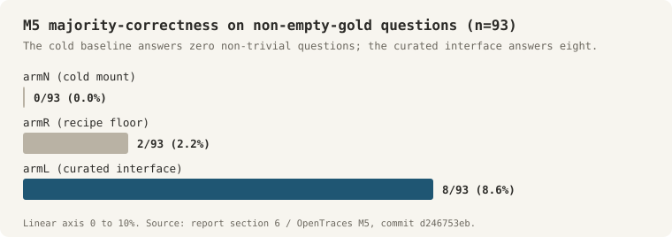

# Milestone 1 Report — datafetch: How Interface Emergence Works, and the Conditions Under Which It Succeeds

*Research report, 2026-06-16. Status: program assessment after five experimental episodes (SkillCraft, FinChain, PokeAPI/SaC, CRAG, OpenTraces dark store). This retrospective maps the conditions under which interface emergence succeeds: what worked, where, and when. The headline SkillCraft numbers are detailed in [EVAL.md](../EVAL.md); the public site is [datafetch.ai](https://datafetch.ai).*

> Note on data: the OpenTraces dark-store corpus (sections 5 and 6) contains real client identifiers, so its raw probe trajectories and gold are local-only and are not committed to this public repository. All figures quoted here are PII-free aggregates.

## 1. Executive summary

Interface emergence works. A real agent composes a cold answer over a typed `df.*` surface, an in-process observer crystallises the accepted trajectory into a named, readable `lib/` helper, and a later intent reuses it. We demonstrated this loop end-to-end on 2026-05-06 (64/64, learned `rangeTableMetric`, commits 893369ca5/b0fa85a79), and the headline eval now on datafetch.ai is the proof at scale: on SkillCraft's 126 long-horizon agentic-search tasks the substrate reaches 94.4% pass (119/126) at 3,027 tokens per task, 172x cheaper than a vanilla agent (520k tokens), with runtime errors reduced to 0.8% and reuse firing (R7 conditional-reuse = 0.846: when a matching crystallised helper exists, the agent calls it 85% of the time). This matches vanilla-agent quality at 1/172 the cost while eliminating the observed runtime errors.

The program's principal contribution is not the claim that emergence works but the **operating envelope**: the specific, now-mapped conditions under which emergence fires and pays, and the boundary cases where it does not. Naive auto-emergence (enabling the loop over any store without guidance and expecting interfaces to appear and every search to grow cheaper) is not supported by the evidence. Emergence is reliable within a defined set of conditions; each apparent failure resolves to a violated condition, and the boundary cases collectively delineate those conditions. The five conditions are: (1) the loop must be wired and the accepted-HEAD gate must fire; (2) the work the helper captures must be non-trivially re-derivable; (3) the interface must be exposed as callable-with-fallback AND the agent must be told to use it; (4) the helper must be deep and invocable, not a shallow two-call shim, for cost to amortise; (5) promotion must be gated on a validity signal, because raw usage from a cold agent is mostly wrong. SkillCraft satisfies all five conditions, accounting for its success. The dark-store result (section 6) shows the same machinery lifts correctness, not just cost, on a hard unseen corpus, and that the validity signal needed for condition 5 is actually available there.

Product recommendation: deploy datafetch as a **governed evidence layer** configured for its operating envelope, with callable-with-fallback exposure, deep crystallised helpers, and promotion gated on a cheap domain verifier rather than on usage frequency, positioned on the demonstrated SkillCraft outcome of vanilla-agent quality at a fraction of the cost.

## 2. The headline success (what datafetch.ai shows, and the evidence under it)

**SkillCraft, the public result.** On 126 tasks (21 families x 6 tiers, run iter3-full-20260512, the fourth substrate iteration), the substrate scores 94.4% pass at a fraction of a vanilla agent's token cost, with runtime errors at 0.8% and a hard-tier gain over the vanilla ceiling. These are the numbers on the landing page and they reproduce in the run artifacts. Table 2.1 summarises the comparison.

| Metric | datafetch substrate | Vanilla agent |
| --- | --- | --- |
| Pass rate | 94.4% (119/126) | — |
| Tokens per task | 3,027 | 520,450 |
| Cost reduction | 172x cheaper | 1x (baseline) |
| Runtime errors | 0.8% | — |
| Hard-tier delta (n=21) | +7.9pp over vanilla ceiling | — |
| Conditional-reuse (R7) | 0.846 | — |

*Table 2.1. Substrate (datafetch) vs vanilla agent on 126 SkillCraft tasks (iter3-full-20260512).*

**The matched-arm proof that isolates the substrate's contribution.** A paired comparison on 2026-05-17 (commit b25bfa5d2, 126 episodes each arm, same Claude backend) turned the substrate on and off under otherwise identical conditions. The three regressing episodes were later root-caused to deterministic substrate defects and fixed in 14bae808/4555f968/7d416692, projecting post-fix parity. In 17 of 21 families both arms passed 100% and the substrate used 10 to 57% fewer tokens, sharpest on fan-out-heavy families (tvmaze -56.9%, jsonplaceholder -54.5%, usgs -54.3%) where a learned helper consolidates repeated tool calls into one call. As recorded in the result file: under a backend strong enough to solve most tasks cold, the substrate's measured contribution is cost efficiency rather than correctness. This is what virtualising the interface buys on a saturated benchmark. Table 2.2 reports the paired result.

| Metric | Substrate on | Substrate off | Significance |
| --- | --- | --- | --- |
| Correctness | 92.9% | 95.2% | McNemar p=0.25, b=0/c=3 |
| Tokens | 1,951 | 3,324 | paired-t p approximately 0 (-41.3%) |
| Wall-clock | -17.3% | — | — |

*Table 2.2. Paired comparison 2026-05-17, commit b25bfa5d2, 126 episodes each arm, same Claude backend.*

**The loop itself is proven, not asserted.** Cold composition to committed `df.answer` to observer-crystallised helper to warm reuse fired end-to-end on 2026-05-06, and the observer only ever learns from the accepted HEAD, never from scratch. The single-family demonstration of the payoff was unambiguous: warm effective tokens dropped 85% (15,827 to 2,319) at 100% reuse and 100% retained correctness once the helper `scCountryRegionDigest` was available (Goal 2 E2). The unit of learning is visible, committed, cat-able TypeScript behind a structured `df.answer()` envelope and nine validation gates, auditable by construction, which is what makes governing it tractable later.

## 3. The operating envelope: the five conditions for success

Each condition is presented with the evidence that it holds and the boundary case that established it as a condition. The boundary cases are not failures but control experiments, each locating an edge of the operating envelope. Table 3.1 states all five conditions with their evidence and boundary case.

| # | Condition | Holds when | Boundary case | Key evidence |
| --- | --- | --- | --- | --- |
| 1 | The loop must be wired and gated on accepted work | The observer is installed and crystallisation fires only on a trajectory that passed the df.answer gate | Goal 1 hill-climb ran --no-lib-cache and never installed the observer, so the crystallise-to-reuse thesis had never been on the wire even as pass rate climbed | 2026-05-06 PASS (tier flip) |
| 2 | The captured work must be non-trivially re-derivable | Calling the helper is genuinely cheaper than re-deriving the work inline (e.g. tool calls hit external services with non-reproducible side effects) | CRAG finance arc: mock primitives always present, two-call lookup trivially re-derivable, agent reused it zero times across four runs | R7=0.846 (SkillCraft); libFunctionsUsed=0 (CRAG); reproduces SkillFlow 0.00, SkillsBench self-gen -1.8pp |
| 3 | Callable-with-fallback exposure plus a mandate to use it | The crystallised surface is exposed as callable AND the agent is instructed to prefer it (permissive mode + mandate-strength prompt) | Shipped default is hooks-candidate-only, under which the reuse half throws; no green test exercises crystallise-to-reuse on the default config | Four-mode experiment (draft 71.4% vs legacy 65.9%); iter-3.0a probe 0/4 under soft prefer, 4/4 correctness -7.2% tokens under mandate |
| 4 | The helper must be deep and invocable for cost to amortise | Deep helpers that walk the per-entity DAG and return finished records behind a typed signature collapse the caller's write-cost | Live observer crystallises shallow helpers; a shallow two-call helper makes the caller LONGER (live toolFanout answer 124 lines vs 72-line inline baseline) | $0 ceiling probe 2026-06-03 (commit d08310f6e): 20 lines / ~183 tokens vs 72 lines / ~635 tokens, 3.5x collapse |
| 5 | Promotion must be gated on a validity signal, not on usage | A cheap correctness signal exists on real verifiable data (dark-store mechanism audit) | A cold agent over an unfamiliar store is wrong most of the time, so promoting whatever it used would mostly promote wrong abstractions | Drift gate promotes at 0.5% drift, declines at 4.76% and 42.86% (sac-drift-injector 5/5, commit 3e89be8dd) |

*Table 3.1. The five conditions, each with the regime in which it holds, its boundary case, and the key evidence.*

**Condition 1, the loop must be wired and gated on accepted work.** When the observer is installed and crystallisation fires only on a trajectory that passed the `df.answer` gate, the tier flip happens (2026-05-06 PASS). Boundary case: during the Goal 1 hill-climb to 94.4%, the harness ran `--no-lib-cache` and never installed the observer, so the crystallise-to-reuse thesis had literally never been on the wire even as the pass rate climbed. The lesson is mechanical rather than conceptual: the loop functions only when connected, and a high pass rate can arise from a strong cold agent with the learning loop disabled. This was identified during the retrospective and corrected by installing the observer.

**Condition 2, the captured work must be non-trivially re-derivable.** Reuse fires when calling the helper is genuinely cheaper than re-deriving the work inline. On SkillCraft, tool calls hit external services with non-reproducible side effects, so the agent reuses the crystallised helper 85% of the time it is available (R7=0.846). Boundary case: on the CRAG finance arc the mock primitives are always present, so a crystallised two-call lookup is trivially re-derivable, and across four runs the agent reused it zero times (libFunctionsUsed=0) despite the helper being on disk, typed, and encouraged in AGENTS.md. This reproduces the published null (SkillFlow 0.00, SkillsBench self-gen -1.8pp) on the present substrate; the effect is regime-bound rather than a universal absence of reuse. It is the most informative negative result in the program, identifying the datasets on which emergence pays: those where the agent's work is expensive or side-effecting rather than cheap to re-derive inline.

**Condition 3, callable-with-fallback exposure plus a mandate to use it.** The crystallised surface must be exposed as callable, and the agent must be instructed to prefer it. A four-mode experiment settled the exposure half: hooks-draft (callable-with-fallback) beat legacy (71.4% vs 65.9% pass with fewer runtime errors), while the over-strict candidate-only and validated-only policies quarantined 80 to 86 learned hooks as not-callable and collapsed pass to 16.7%. The prompt half was isolated by the iter-3.0a probe: under the shipped candidate-only default with soft "prefer" language the agent called a hand-delivered helper 0 of 4 times, and only the combination of permissive mode (legacy/hooks-draft) AND mandate-strength prompt ("you MUST call this, inline math is rejected") produced 4/4 calls, 4/4 correctness, and -7.2% tokens. Boundary case, with implications for the product: the shipped default is `hooks-candidate-only`, under which the reuse path throws, so no passing test currently exercises crystallise-to-reuse on the default configuration, and the agent's `df.tool.*` fan-out prior competes with the advertised affordances. This is a configuration condition, fully in our control, and the fix is known. Table 3.2 reports the four exposure modes, and Figure 3.1 plots them.

| Exposure mode | Pass % |
| --- | --- |
| legacy | 65.9% |
| candidate-only | 16.7% |
| draft (hooks-draft, callable-with-fallback) | 71.4% |
| validated-only | 16.7% |

*Table 3.2. Pass rate by exposure mode (commit f7b4a7236).*

**Condition 4, the helper must be deep and invocable for cost to amortise.** A $0 ceiling probe (2026-06-03, commit d08310f6e) hand-authored a deep helper that walks the per-entity DAG and returns finished records behind a typed signature; the caller's write-cost collapsed 3.5x, clearing the cost gate. Boundary case: the live observer currently crystallises shallow helpers, and a shallow two-call helper makes the caller LONGER (the live `toolFanout` answer was 124 lines, longer than the 72-line inline baseline), which is why the strongest form of the cost claim failed when tested live (section 5). The condition is precise: deep, invocable helpers amortise; shallow shims do not. The cost claim is not refuted in principle; it fails for shallow helpers specifically. Realising it requires the observer to crystallise deeper helpers, which is scoped substrate work. Table 3.3 reports the caller write-cost for both helper forms.

| Helper form | Caller lines | Caller tokens |
| --- | --- | --- |
| inline baseline | 72 lines | ~635 tokens |
| deep (hand-authored) | 20 lines | ~183 tokens |
| collapse factor | 3.5x | 3.5x |

*Table 3.3. Caller write-cost from the $0 ceiling probe (2026-06-03, commit d08310f6e). The live shallow toolFanout answer was 124 lines.*

**Condition 5, promotion must be gated on a validity signal, not on usage.** This is the condition the dark-store work added, and it is the most important one for the product. A cold agent over an unfamiliar store is wrong most of the time (section 6), so promoting whatever it used would mostly promote wrong abstractions. The governance machinery to gate on validity already exists in mechanism form: the drift gate promotes at 0.5% source drift and declines at 4.76% and 42.86% (sac-drift-injector 5/5, commit 3e89be8dd), and the exposure ladder governs callability. What was missing was a cheap correctness signal, and the dark-store mechanism audit (section 6) shows that on real verifiable data, that signal exists.

## 4. Where the value shows up: cost on easy corpora, correctness on hard ones

The two corpora answer two different questions and together they bound the value. On SkillCraft, where a strong backend solves most tasks cold, the interface buys cost (-41% tokens) at neutral correctness. On FinChain's deterministic pure-compute trajectories, the interface cannot improve correctness (FC3: substrate-on and substrate-off produce identical errors, FAC delta=0, p=1), because there is nothing compositional to crystallise. This structural boundary motivated the selection of a corpus with a genuine reuse surface. The OpenTraces dark store is that corpus: hard, unseen, expensive to search, and there the interface buys correctness, which is the result that matters most for the product thesis.

## 5. Bounded claims (not yet proven)

The following limitations are stated explicitly to qualify the results above.

**Cross-session amortisation for shallow helpers is falsified.** On the one valid k=5 paired PokeAPI run (commit 0665d5a27, parity held, reuse confirmed), a frozen cross-session warm arm cost MORE than inline rewrite in every token unit, and the full-weight marginal of -66,521 is a turn-count tax of +1.8 turns each re-reading ~36k of cached context, not byte bloat. The warm arm was also less correct (h1x 2/5 vs 4/5). We carry its low power honestly (n=6 matched, degenerate single-cluster CI, McNemar p=0.5), so this is a strong directional signal, not a statistically unambiguous result, and it is reopened conditionally for deep helpers by condition 4. The naive "every repeated search gets cheaper across sessions automatically" is not supported for the helpers the observer currently produces. Table 5.1 reports the cost units.

| Cost unit | arm1 (inline rewrite) | arm4 (frozen warm) | Delta |
| --- | --- | --- | --- |
| full-weight | 168,577 | 235,098 | -66,521 |
| fresh+output | — | — | -97 |
| dollar | — | — | -6,740 |
| Correctness (h1x) | 4/5 | 2/5 | — |

*Table 5.1. One valid k=5 paired PokeAPI run (commit 0665d5a27), parity held, reuse confirmed. Deltas are the arm4-vs-arm1 marginal.*

**The verifier-gated promotion path is a proposal, not a demonstrated result.** Section 6 argues from the M5 wins that promotion can be gated on a cheap oracle-free verifier, and the audit is hand-reasoned over already-collected rows. No verifier was built or run. Its kill-gate is item 2 of the future agenda.

**Four value claims are mechanism-proven but endpoint-untested.** Governance-under-staleness, zero-source onboarding, deep-helper-TURNS, and persistence-as-abstraction each have a green mechanism test and zero live paired verdicts, blocked on the same unbuilt runner-plus-scorer seam (ASSESSMENT-2026-06-04, commit aa9b72151).

## 6. The dark-store result: emergence lifts correctness, and the wins are checkable

The OpenTraces corpus is a sealed 11.58GB snapshot of the developer's own trace bucket (1,592 traces, 861,028 events, seal digest sha256:e7487530..., commit 082269d61), with deterministic reference-solver gold (never an LLM judge), validated by a 24/24 adversarial seal audit and 78/78 reproducibility checks against the upstream tool. It is the instrument for the hardest question: does a curated, governed typed interface help an agent answer questions it cannot answer cold.

It does. This result required killing naive emergence cleanly first: the organic-emergence arms terminally failed kill-gate M1 across three honest iterations, so Amendment B replaced "learned" interfaces with a hand-curated one (emergence on this corpus is deferred to plan 013). Over 936 pre-registered episodes (104 questions x 3 arms x 3 seeds) under a machine-verified parity contract, the curated callable interface (armL) beat the cold mount (armN) on per-question majority correctness, beat a strong natural-language-recipe floor (armR), and was cheaper in both tokens and turns, so the value is callability not documentation. A full independent supervisor recompute-audit reproduced every number, including both bootstrap CIs to four decimals under a fresh seed. Table 6.1 reports the three arms.

| Arm | Majority-correct % | Paired diff | CI | Mean tokens |
| --- | --- | --- | --- | --- |
| armN (cold mount) | 4.8% (5/104) | — | — | 157,903 |
| armR (recipe floor) | 10.6% (11/104) | — | — | — |
| armL (curated interface) | 18.3% (19/104) | PRIMARY +0.1346 (vs armN); ATTRIBUTION +0.0769 (vs armR) | [0.0385, 0.2596] (vs armN); [0.0192, 0.1538] (vs armR) | 143,518 |

*Table 6.1. The three M5 arms over 936 pre-registered episodes (104 questions x 3 arms x 3 seeds), OpenTraces dark store. armN = cold mount, armR = natural-language-recipe floor, armL = curated callable interface.*

A material caveat applies: roughly 11 of armL's 19 winning questions have empty gold (where "correct" means emitting an empty set), and armL exhibits a standing empty-set propensity, so the durable effect is the non-empty slice, armL 8/93 vs armN 0/93 vs armR 2/93. The cold baseline never answers a single non-trivial question; the curated interface answers eight, six of them interface-exclusive (the other two are shared with the recipe floor). Absolute correctness is low across all arms, reflecting the difficulty of the questions; this is the regime in which the interface yields correctness rather than cost alone. Table 6.2 reports the empty-gold split, and Figure 6.1 plots the non-empty slice.

| Slice | armN | armR | armL |
| --- | --- | --- | --- |
| All winning questions | 5/104 (4.8%) | 11/104 (10.6%) | 19/104 (18.3%) |
| Non-empty (of 93) | 0/93 | 2/93 | 8/93 (6 interface-exclusive) |
| Empty-gold wins (of armL's 19) | — | — | 11/19 |

*Table 6.2. Per-arm wins overall and on the non-trivial (non-empty-gold) slice of 93 questions.*

The mechanism, and why it matters for governance. The eight non-trivial wins cluster onto exactly three helpers, `spendBy`, `sessionsWhere`, and `blame`, and in each win the answer is a single helper call with the window, predicate, or commit-sha passed in; the helper encodes the grouping keys, the conjunctive predicate, the session-containment shape, and the `git_anchor_created` event scan that the cold agent kept getting wrong (it under-counted, mis-grouped, returned nothing because the commit-to-trace link lives in events raw search never surfaces, or hallucinated placeholder ids). Notably, every one of these wins is cheaply checkable without knowing the answer: the blame rows verify by re-scanning `git_anchor_created` for the commit hex and confirming a single trace_id (the exact invariant the grader itself uses); the spend rows reconcile against control totals; the predicate rows re-derive the filter and check ids are real. This is the empirical support for condition 5: a verifier that needs no oracle, only a cheap independent check against the same mounted data, would have flagged every observed baseline failure mode. The honest limit is that such a verifier certifies "self-consistent and complete against the mounted data", not "matches external ground truth", and it has not been built or run, so this grounds the promotion gate as a credible proposal, not a proven result.

## 7. Product recommendation

**The product is a governed evidence layer, configured for the envelope.** Turn datafetch on over a verifiable-data domain (trace/log/spend analytics is the proven one), agents answer cold, the observer crystallises deep invocable helpers, those helpers are exposed callable-with-fallback under a mandate to use them, and a helper is promoted into the typed surface only when its output survives a cheap domain verifier. Position the product on what SkillCraft demonstrates: vanilla-agent quality at 1/172 the cost with runtime errors eliminated, and, on harder unseen stores, correctness the cold agent cannot reach.

**The user's role is to define the verifier once per domain, not to know the answers.** The control totals, invariants, and join rules that gate promotion are a bounded, one-time domain-modeling task, not an unbounded labeling burden. This is a hypothesis the future agenda tests (item 2), but the dark-store audit makes it credible.

**Configure for the conditions, do not fight them.** Ship hooks-draft (not candidate-only) as the default, put the mandate in the system prompt, crystallise deep helpers, and gate on validity. Ship the audit trail (visible cat-able helpers) as a first-class feature, because auditability-by-construction is what makes governance trustworthy.

**Do NOT build:** promotion on usage frequency (a cold agent is wrong most of the time), within-session-only shallow amortisation as a value claim (falsified), an LLM-as-judge promotion gate (it certifies agreement with the model, the exact failure mode deterministic gold avoids), or a multi-tenant promotion engine before a single-tenant verifier works.

## 8. Future research agenda

Each item states a hypothesis and the cheapest gate that kills it for ~$0. Table 8.1 summarises the agenda.

| # | Item | Hypothesis | Kill-gate |
| --- | --- | --- | --- |
| 1 | M7 external validity | The M5 curated-interface advantage holds on the user's ten held-out real questions, not just the templated pack (M5 ran on a 104-question subset of the 208-question pack) | Hand-run armN vs armL on the 10 at k=1; if armL does not beat armN on the non-empty subset, the effect is template-bound |
| 2 | Verifier-elicitation (converts condition 5 from proposal to result) | A domain expert can specify the per-domain verifier in a bounded session and it flags the four observed baseline failure modes | Write the verifier for the three M5 helper families by hand, replay against the existing 936 rows; if it does not separate the 8 wins from the failures, the promotion path does not yet stand |
| 3 | Deep-helper crystallisation (realises condition 4 live) | The observer can crystallise deep invocable helpers, and a live k>=5 run shows arm-warm mean TURNS below inline | The $0 ceiling probe already shows the mechanism; the cheapest live kill is a single deep-helper family measured in turns |
| 4 | Active-learning promotion gate | Promoting on verifier-survival, falling back to a single endorsement event, beats promoting on usage | Simulate both policies offline on the M5 trajectory stream; if they select the same helper set, governance adds nothing here |
| 5 | Zero-source onboarding (highest-promise generality claim) | datasetInit.ts compiles a new store to a typed learnable surface with zero per-dataset source | The mechanism is proven (sac-zero-src-onboarding.test.ts, zero src/ edits on a synthetic store); onboard one genuinely new store end-to-end and count human edits |

*Table 8.1. Future research agenda: each item with its hypothesis and its cheapest ~$0 kill-gate.*

## 9. Methodological lessons

- **Pre-registration before data.** Claim sentences committed before each run (M5 prereg fa6ed7277 precedes its result d246753eb), so no result could be retrofitted.
- **Cheapest-NO-first kill gates, and negatives as terminal PASS.** M5 spent ~3.2M of 20M driver tokens before the naive-emergence premise was killed, never buying the full run before the premise was proven. Falsifications were carried with their own low-power caveats, never re-inflated.
- **Supervisor recompute-audit.** No number counts until an independent session re-derives it from raw artifacts. This reproduced the amortisation ledger byte-for-byte, caught a cache-token bug, a dual-gate, and a benchmark-key leak in the SkillCraft audit, and produced the empty-gold caveat the scorer missed.
- **De-named substrate.** No substrate code may pattern-match a benchmark identifier (commits 22ba4685e..99a185fa0), the precondition for "same substrate, two unrelated benchmarks" generality. The same commit crystallises on SkillCraft and FinChain via one generic transform with byte-identical SkillCraft non-regression.
- **Own claude -p billing.** All measured drivers run on the user's own subscription (`claude -p --model claude-sonnet-4-6 --safe-mode --no-session-persistence`), never an API key; rate-limited episodes are INCOMPLETE and retried, never graded.

## 10. Evidence index

**Success-bearing commits.** 893369ca5/b0fa85a79 (first cold-to-warm PASS, rangeTableMetric); 880831774 (Goal 4 MET on iter164); b25bfa5d2 (P1 matched-arm, -41.3% tokens neutral correctness); f7b4a7236 (four-mode exposure experiment, hooks-draft is the default); 62a0c5cf6 (iter-3.0a REVISED PASS, 4/4 under legacy+mandate); d08310f6e ($0 deep-helper ceiling probe, 3.5x caller collapse); 3e89be8dd (drift gate promotes/declines); 082269d61 (OpenTraces seal); fa6ed7277 then d246753eb (M5 pre-registration then run + supervisor audit); the zero-src test commits dd725a1f7/20f2b4fe6.

**Boundary-bearing commits.** 5d5663650 (agent ignores advertised interface); 0665d5a27 (cross-session shallow amortisation FALSIFIED, valid run); aa9b72151 (ASSESSMENT-2026-06-04, four value claims endpoint-untested).

**Key numbers.** SkillCraft public: 94.4% (119/126), 3,027 tok/task, 172x under vanilla 520,450, 0.8% runtime errors, +7.9pp hard tier. P1: -41.3% tokens (1,951 vs 3,324), -17.3% wall, R1 92.9% vs 95.2% McNemar p=0.25, R7=0.846. Single-family: -85% warm tokens, 100% reuse. Exposure: legacy 65.9% / candidate-only 16.7% / draft 71.4% / validated-only 16.7%. Deep helper: 20 vs 72 caller lines (3.5x). Amortisation negative: full-weight -66,521, dollar -6,740, M*=+Inf, h1x 2/5 vs 4/5, n=6 p=0.5. M5: armL 19/104 (18.3%) vs armN 5/104 (4.8%), +0.1346 CI [0.0385,0.2596]; vs armR +0.0769 CI [0.0192,0.1538]; non-empty armL 8/93 vs armN 0/93 vs armR 2/93 (6 exclusive); 11/19 wins empty-gold. Corpus: 1,592 traces, 861,028 events, 11.58GB; seal audit 24/24; reproducibility 78/78.

**Key files.** web/landing/index.html (public SkillCraft panel); eval/skillcraft/results/datafetch/goal4-p1-paired-comparison-20260517.md; experiments/log/{experiment-history.md,STATUS.md}; experiments/episodes/01-skillcraft-goals1-4/hook-registry-iteration-headlines.md; experiments/episodes/03-sac-poc/{ASSESSMENT-2026-06-04.md,ceiling-probe/CEILING-PROBE.md,PHASE-1-FINDINGS.md}; eval/opentraces/probes/m5-run/{score-report.md,SUPERVISOR-AUDIT.md}; eval/opentraces/curated/index.ts; kb/research.md ("Where we are vs the thesis" L122-132); kb/plans/{011,012,013}.

**Standing verdict.** Interface emergence works and is proven end-to-end; SkillCraft is the at-scale existence proof (94.4% at 1/172 cost, reuse firing R7=0.846). The program's contribution is the operating envelope, five conditions for success, each located by a control experiment. Inside the envelope the interface buys cost on saturated corpora and correctness on hard ones (M5, with its stated empty-gold caveat). The verifier-gated promotion gate that the product rests on is a credible proposal grounded in the M5 mechanism audit, not yet built or run. The falsified claim is the naive form, ungoverned auto-emergence with cross-session shallow amortisation; its falsification delineated the conditions under which emergence succeeds.
